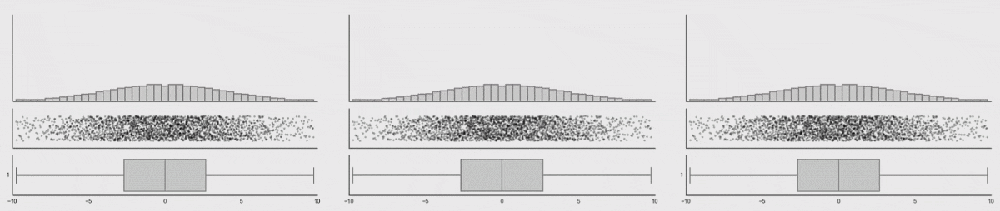
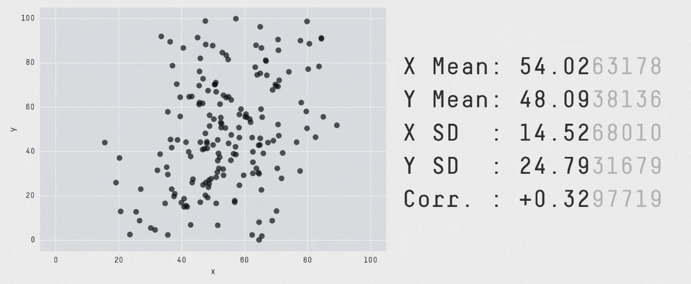
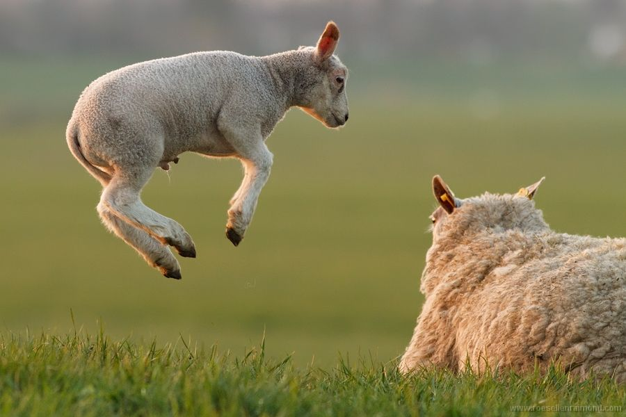

<!-- edit name1 and name2 in the YAML above -->

```{r setup, include=FALSE}
options(htmltools.dir.version = FALSE)
knitr::opts_chunk$set(warning = FALSE, message = FALSE)
library(tidyverse) # load tidyverse package
library(babynames) # load babynames package
library(leaflet) # uncomment to use if you install
```


<!-- introduce yourself here -->

Hello my name is `r rmarkdown::metadata$author`!

Say something about what you do, what you use R Markdown for, your favorite R package, etc.

<!-- include an image here, if you have a GitHub account use your profile pic! -->

```{r photo, echo = FALSE}
knitr::include_graphics("https://github.com/USERNAME.png") # update USERNAME here
```


---
<!-- we make the data here -->

```{r filterdata}
# getting the data
namedata <- babynames %>%
  filter(name == params$name1 | 
           name == params$name2) %>% 
  filter(sex == "F") 
```

<!-- get and see top years for each name -->

```{r gettopyears}
topyears <- namedata %>% 
  group_by(name) %>% 
  top_n(1, prop) 
```

---
```{r topyear-name1}
topyears %>% 
  filter(name == params$name1)
```


```{r topyear-name2}
topyears %>% 
  filter(name == params$name2)
```

---
<!-- plot name popularity over time -->


```{r}
ggplot(namedata, 
  aes(x = year, 
      y = prop,  
      group = name, 
      color = name)) + 
  geom_line() 
```

---
<!-- where are you from? -->
---

```{r eval = TRUE}
# erase this chunk option if you want to include a map
library(leaflet)
leaflet() %>% addTiles() %>% setView(lat = 1.29563, lng = 103.77502, zoom = 17)
```


---
# Datasaur
```{r, echo=FALSE}
knitr::include_graphics("img/DinoSequentialSmaller.gif")
```

---
# Boxplots
```{r, echo=FALSE}

```


---
# Boxplots and Violin Plots
```{r, echo=FALSE}
knitr::include_graphics("img/BoxViolinSmaller.gif")
```


---
# Two plots side by side

.pull-left[
## Left side
```{r,  echo=FALSE}

```
]

.pull-right[  
## Right side
```{r, ,  echo=FALSE}

```
]


