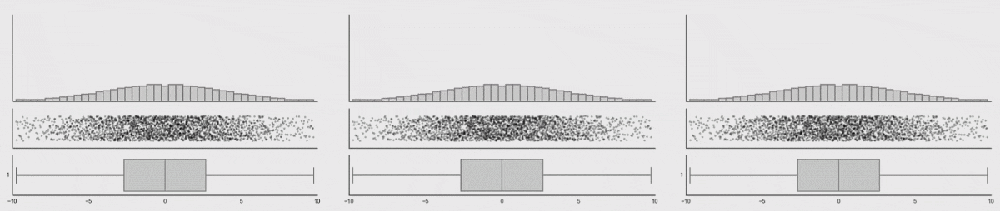

class: inverse, middle, center
# MOTIVATION

```{css echo=FALSE}
.highlight-last-item > ul > li,
.highlight-last-item > ol > li {
  opacity: 0.5;
}
.highlight-last-item > ul > li:last-of-type,
.highlight-last-item > ol > li:last-of-type {
  opacity: 1;
}
```


```{r xaringan-themer, include=FALSE, warning=FALSE}
library(xaringanthemer)
style_duo_accent(
  primary_color = "#003D7C",        # NUS Blue
  secondary_color = "#EF7C00",      # NUS Orange
#  header_font_google = google_font("Amatic SC"),
#  text_font_google = google_font("Crete Round"),
  header_font_google = google_font("Cabin"),
  text_font_google = google_font("Noto Sans"),
  header_h1_font_size = "2.5rem",
  header_h2_font_size = "1.75rem"
)
```


```{r xaringan-logo, echo=FALSE}
xaringanExtra::use_logo(
  image_url = "img/nus_logo_full-horizontal.jpg"
)
```

```{r xaringan-tile-view, echo=FALSE}
xaringanExtra::use_tile_view()
```


```{r xaringan-tachyons, echo=FALSE}
xaringanExtra::use_tachyons()
```

```{r setup, include=FALSE}
options(htmltools.dir.version = FALSE)
knitr::opts_chunk$set(warning = FALSE, message = FALSE)
library(tidyverse) # load tidyverse package
library(babynames) # load babynames package
library(leaflet) # uncomment to use if you install
library(datasauRus)
library(ggsci)
```

```{r xaringanExtra, echo = FALSE}
xaringanExtra::use_progress_bar(color = "#0051BA", location = "top")
```


---
class:middle
- bring attention to experiment design

- recall scientific method

- remind about importance of data visualization and checking for normality

- practical application of these remarks for infrared characterization of malaria infected red blood cells

- introduce optically detected photothermal effect spectroscopy


---
class: inverse, middle, center
# SCIENTIFIC METHOD


---
SOME HISTORY

- ancient Greeks (7<sup>th</sup>-3<sup>rd</sup> century BC)

--

- early Muslim scientists  (11<sup>th</sup> century AD)
    - Ibn al-Haytham
    - Abu Rayhan 
    - al-Biruni
    - Ibn Sina

--

- Robert Grosseteste, Roger Bacon, Ockham's razor (13-14<sup>th</sup> century AD)

--

- Francis Bacon, Rene Descartes, Galileo, Robert Boyle, Isaac Newton (17<sup>th</sup> century AD)

--

- Karl Popper and Thomas Kuhn (20<sup>th</sup> century AD)

---
# GUIDELINE

 1. Define a question
 
--

 2. Gather information and resources (observe)
 
--

 3. Form an explanatory hypothesis
 
--

 4. Test the hypothesis by performing an experiment and collecting data in a reproducible manner
 
--

 5. Analyze the data
 
--

 6. Interpret the data and draw conclusions that serve as a starting point for a new hypothesis
 
--

 7. Publish results
 
--

 8. Retest (frequently done by other scientists)


---
# ITERATION

 1. Define a question

 2. Gather information and resources (observe)

 3. **Form an explanatory hypothesis**

 4. **Test the hypothesis by performing an experiment and collecting data in a reproducible manner**

 5. **Analyze the data**

 6. **Interpret the data and draw conclusions that serve as a starting point for a new hypothesis**

 7. Publish results

 8. Retest (frequently done by other scientists)


---
## Other components

.pull-left[

- Replication

- External review

- Data recording and sharing

- Instrumentation (Large Hardon Collider, James Webb Space Telescope, SSLS)
]

.pull-right[  

```{r, ,  echo=FALSE}

```
]


---
class: inverse, middle, center
# NORMAL DATA

---

## Why this is important?

Many statistical tests rely on *assumption of normality*

- one sample t-test

- two sample t-test

- ANOVA

- linear regression

- MRC

- Hierarchical linear modeling


If this assumption is violated the results of these tests become unreliable and we are unable to generalize our findings from the sample data to the overall population with confidence.


---

```{r, echo=FALSE, out.width = "90%"}

```


---
## How to check?

- visually

  1. histogram
  
  2. distribution
  
  3. Q-Q plot
  
  4. violin plot
  
- by formal statistical tests

  1. Shapiro-Wilk
  
  2. Kolmogorov-Smirnov (Lilliefors)
  
  3. Jarque-Bera
  
  4. Anderson-Darling
  
  5. Cramer-von Mises
  
  6. Pearson chi-square

---
class: center
## Distributions
```{r, echo=FALSE, out.width = "50%"}

```


---
class: center
## Q-Q Plot
```{r, echo=FALSE,  out.width = "60%"}

```


---
## What to do if we fail the test?

- transform data

  1. log transformation 
  
  2. square root transformation
  
  3. cube root transformation
  
  4. Box-Cox transformation
  
- according to Central Limit Theorem, no matter what distribution is, the sampling distribution of mean tends to be normal if the sample is large enough (n ≥ 30)  
  
- use statistical tests for not normal distributions (non-parametric tests)


---
class:center
## Log transformation
```{r, echo=FALSE,  out.width = "60%"}

```


---
class: inverse, middle, center
# DATASAURUS


---
# Warning: DatasauRus
```{r, echo=FALSE}
knitr::include_graphics("img/DinoSequentialSmaller.gif")
```


---

```{r, fig.width=12}

datasaurus_dozen %>%
  ggplot(aes(x, y, color = dataset)) +
  geom_point(show.legend = FALSE) +
  facet_wrap(~dataset, ncol = 5)+theme_bw()+
 scale_color_d3("category20")

```


---

```{r, }

knitr::kable(
datasaurus_dozen %>%
  group_by(dataset) %>%
  summarise(across(c(x, y), list(mean = mean, sd = sd)),
    x_y_cor = cor(x, y)))
```


---
# Boxplots
```{r, echo=FALSE}

```


---
# Boxplots and Violin Plots
```{r, echo=FALSE}
knitr::include_graphics("img/BoxViolinSmaller.gif")
```


---
class: inverse, middle, center
# RED BLOOD CELLS

---
# Single cell analysis
```{r, ,  echo=FALSE}

```

---
class: top
# Classic FTIR = diffraction limit


.pull-left[

## Abbe formula

$$\delta = \frac{0.612 \lambda}{N.A.}$$
for $\lambda$ = 10 $\mu$m (1000 cm<sup>-1</sup>) 

N.A. = 0.4 

$\delta$ = 15.3  $\mu$m

]


.pull-right[ 
```{r, ,  echo=FALSE}


```
]

---
class: inverse, middle, center
# OPTIR

---
## HOW IT WORKS

<video width="640" height="480" autoplay loop controls>
<source src="img/OPTIR.mp4" type="video/mp4">
</video>

---


## MODES OF EXPERIMENT

## Single spectrum

.pull-left[

- QCL laser sweep

- motorized stage not moving

- absorption bands over QCL bandwidth (1900-900 cm<sup>-1</sup>)
]

## 
.pull-right[ 
```{r, ,  echo=FALSE}

```
]

---

## Chemical Imaging - Mapping

.pull-left[

- QCL laser sweep for one position

- motorized stage moving in X and Y

- spatial distribution of intensity for particular band

- ratio of two bands

- RGB composite image for three bands

]


.pull-right[ 
```{r, ,  echo=FALSE}

```
]


---

## Hyperspectra

.pull-left[

- QCL laser set to one wavenumber (frequency)

- motorized stage moving in X and Y

- another QCL laser sweep for new position

- spatial distribution of intensity for particular band

- tracking bands shifts

]

.pull-right[ 
```{r, ,  echo=FALSE}

```
]


---
# RESULTS


---
class: inverse, middle, center
# CONCLUSIONS


---
class: highlight-last-item
# Take home message(s)
- scientific method is still valid approach in the research so: 
  1. hypothise 
  2. measure
  3. analyse
  4. repeat!

--

- take care of your data distribution and adequate statistical tests

--

- visualization of data is of utmost importance

--

- do not trust boxplots or summary statistics (mean, SD etc)

--

- single cells infrared characterization is not recommended with classis FTIR microscope due to diffraction limit

--

- novel method (optically detected photothermal effect infrared spectroscopy) is viable alternative 

---
.bg-washed-orange.b--dark-blue.ba.bw2.br3.shadow-5.ph4.mt5[
If a man will begin with  certainties, he shall end in doubts; but if he will be content to begin  with doubts, he shall end in certainties.


.tr[
— Francis Bacon (1605) The Advancement of Learning, Book 1, v. 8
]]


---
## DO NOT JUMP TO CONCLUSION (TOO FAST)

.pull-left[
## 
```{r,  echo=FALSE}
knitr::include_graphics("img/datasauRus.gif")
```
]

.pull-right[  
## 
```{r, ,  echo=FALSE}
knitr::include_graphics("img/sheep.jpg")
```
]


---
class: inverse, middle, center
# THANK YOU !
<style>
.html-widget {
    margin: auto;
}
</style>

```{r eval = TRUE, echo = FALSE, fig.align="center", fig.width=6}
# erase this chunk option if you want to include a map
library(leaflet)
leaflet() %>% addTiles() %>% setView(lat = 1.29563, lng = 103.77502, zoom = 17)
```


